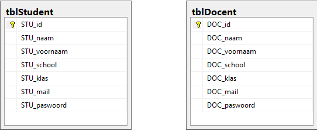

# TeamAnalytics

## Inhoudstafel

[Uitleg](#Uitleg)

[Onderdelen bespreken](#OnderdelenBespreken)

[Projectverloop](#projectverloop)

[TODO](#TODO)

[Resultaten](#Resultaten)

[Licentie](#Licentie)

## Uitleg

Team Analytics is een site gecreëerd door Wouter Roozeleer, student van Odisee Hogeschool. Het doel van deze site is het vergemakkelijken van teamwork tussen studenten en teambeheer voor docenten naar studenten toe.

Studenten kunnen hierin:
- Quizen maken om hun positie in teamwork te vinden
- Elkaar kunnen beoordelen op teamwork
- Files opladen
- Chatten

Docenten kunnen hierin:
- Groepen aanmaken of verwijderen
- Studenten toevoegen aan groepen of verwijderen

##  Onderdelen bespreken

### Student

**Quizen maken**

Een quiz kan de gebruiker (de student) meer duidelijkheid geven over zijn positie in een team. Zo kan je de Belbin test gebruiken om hier een beter zicht op te krijgen.

**Beoordelen (peer-2-peer evaluatie)**

Beoordelingen worden gegeven van student op student. Deze kan constant aangepast worden zodat de docent een grafiek kan krijgen rond deze gebeurtenissen. Aan de hand van deze evaluatiescores kan de website ook een "leaderboard" creëeren.

**Files opladen**

Om de samenwerking tussen studenten vlotter te laten verlopen, heeft de website een opslagruimte voor elke groep. Zo worden files veel sneller en makkelijker gedeeld.

**Chatten**

Om de communicatie beter te laten verlopen tussen studenten (wat vaak een groot probleem kan zijn), heeft de site een chatfunctie. De bedoeling is om alleen met de studenten chtten met wie je in een groep zit.

### Docent

**Groepen aanmaken en verwijderen**

Een teamwork bestaat natuurlijk uit een groep. De leden van zo een groep worden gekozen door de docent zelf.

**Studenten toevoegen of verwijderen uit een groep**

Het gebeurd wel eens vaker dat studenten wisselen van groep, uit een groep gaan of een deelnemen aan een al bestaande groep. De docent kan dit dan ook toepassen zodat de student meteen kan meevolgen.

##  Projectverloop

### Voorbereiding

#### Keuzes maken

Allereerst zal ik moeten kiezen of ik ga met een CSS en HTML pre-processor, is dit wel een goed idee? Verlies ik hier niet teveel tijd mee aangezien dit nieuw is voor mij?

Als volgt ga ik zoeken naar het framework en design dat ik wil gebruiken, ga ik voor material of minimalistisch of toch iets anders?

Een belangrijke vraag zal ook zijn: welke programmeertalen wil ik gebruiken? Hou ik me bij de basis die ik nu ken, of zal ik me uitbreiden naar Python, Node.js, ... die ik nog niet ken?

Eens dit allemaal in orde is kan ik beginnen aan het zoeken van goede quizes in verband met teamwork.

#### Doen

Eens alle voorbereiding klaar is kan ik beginnen met een template te maken om zo al een beter beeld te vormen over de website. Hiermee zit ik al goed aan de front-end om volledig te beginnen.

Wat er wel nog ontbreekt is natuurlijk de backend. Hiervoor zal ik een design maken van de databank met hierin de tabellen die ik nodig zal hebben en hoe deze aan elkaar gelinkt zijn. Dit is iets wat ik in het eerste semester geleerd heb, namelijk dat het design van de database zeer belangrijk is en volledig moet uitgeschreven worden voor je echt kan gaan werken.

### Mijlpaal 1 - deadline: eind 2de semester 15-16

Voor deze mijlpaal wil ik ervoor zorgen dat de docent zelf al gebruikers kan aanmaken zodat niet iedereen zomaar een account zou kunnen maken. Elke student zou ook al één of meerdere quizen moeten kunnen afleggen. Dit betekent dus ook dat hij/zij al kan inloggen. Een eventuele extra hieruit is de percentages te laten zien aan de hand van [DD3](https://d3js.org)

####  Requirements

- Docent kan inloggen
- Docent kan studenten aanmaken
- Studenten kunnen inloggen en basispaswoord aanpassen
- Studenten kunnen quizes makes
- (Extra) Studenten krijgen een duidelijke, visuele weergave resultaten quiz

##  TODO-list

### Voorbereiding

* [x] Keuze maken: pre-processor
* [x] Keuze maken: framework en design
* [x] Keuze maken: programmeertalen kiezen
* [ ] Onderzoeken: Quizes
* [ ] Schrijven: User stories

### Doen

* [x] Template/design maken
* [x] Databank tekenen

### Mijlpaal 1

* [ ] Requierments programmeren

##  Resultaten

### Voorbereiding

Ik heb er al voor gekozen om geen pre-processor te gebruiken aangezien ik al een goede kennis heb over HTML en hiermee vertrouwd ben. Dit geldt ook voor de CSS pre-processor.

Als framework zal ik gebruik maken van [Materializecss](http://materializecss.com/), dit met een oog kijkend op  [Google Material Design](https://www.google.com/design/spec/material-design/introduction.html)

Als programmeertaal ga ik het houden bij de basis om te starten en kijk ik tijdens het project welke talen ik nog zou moeten invoeren.

## Doen

Hier ziet u de basis van de website. Docenten kunnen meerdere accounts aanmaken zodat ze er eentje hebben voor elke klas, zo krijgt de docent ook een simpelere overzicht van zijn studenten.

(krijgt updates doorheen het project)

##  Licentie

Copyright 2016 Wouter Roozeleer

Er is geen licentie hierin gebruikt, de code mag niet verspreid worden, aangepast worden of een sublicentie krijgen. Dit project, of code hiervan, kan gebruikt worden (na goedkeuring van Wouter Roozeleer) om zelf op commerciele of private wijze gebruikt te worden.
